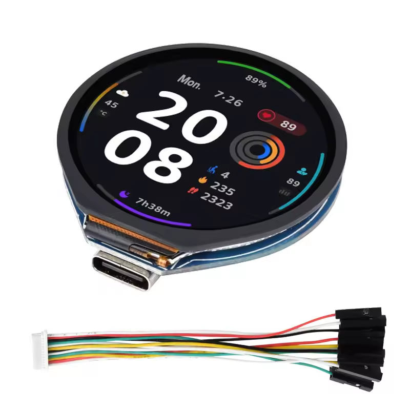
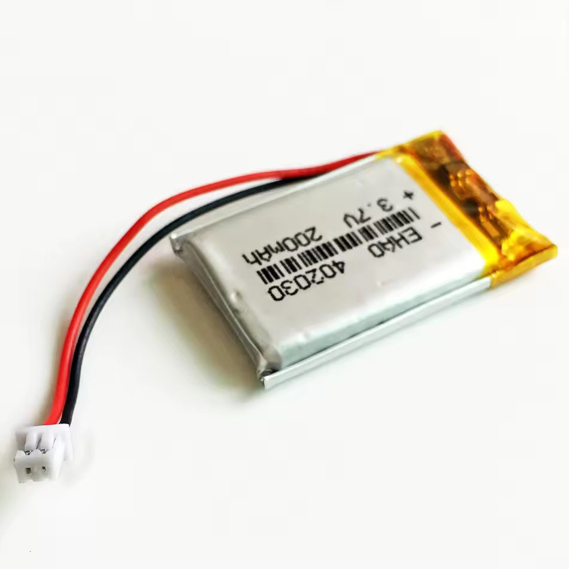
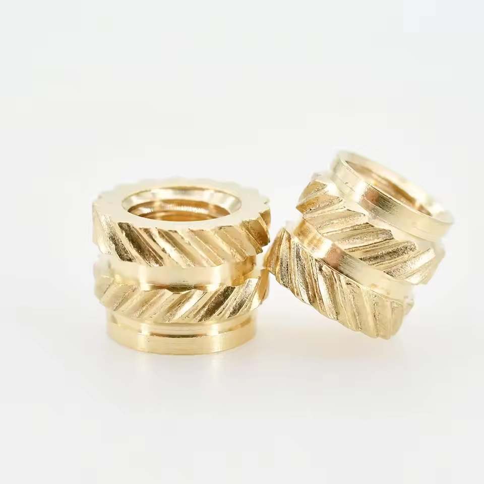
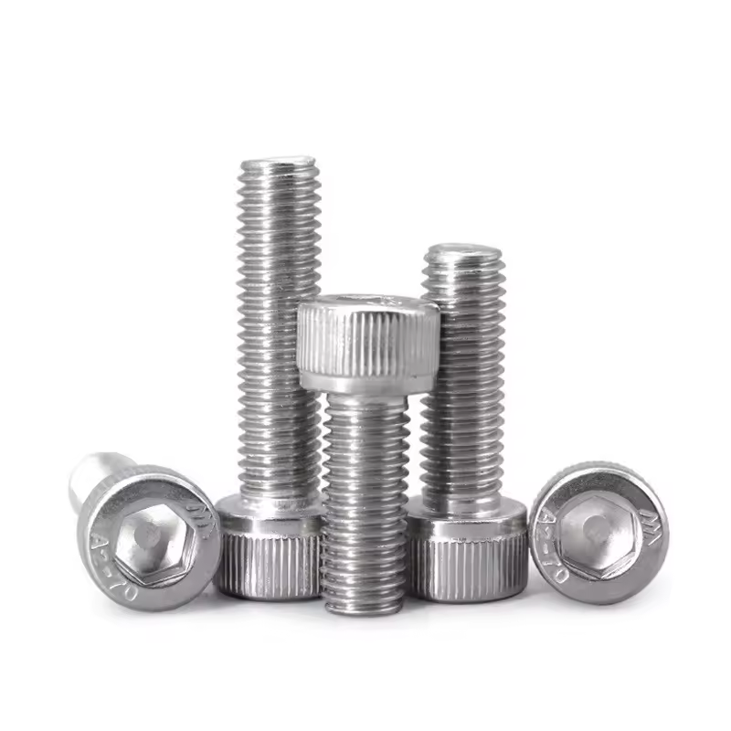
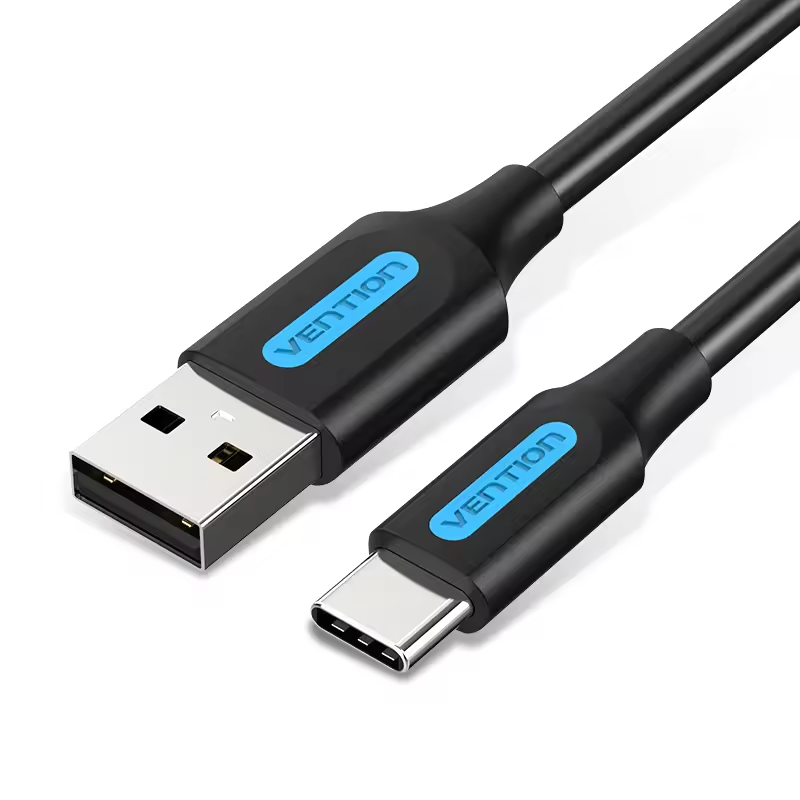

# Hardware Requirements

This section outlines the complete list of hardware components required to assemble a functional **TiltSense** device.
The chosen components are optimized for compactness, reliability, and ease of assembly, leveraging widely available and
affordable parts.

## Required Components

### 🔹 ESP32-S3 with 1.28" Round Touchscreen

[Buy on AliExpress](https://s.click.aliexpress.com/e/_oBHq2mi)

  

A compact, all-in-one ESP32-S3 development board featuring:

- A 1.28" round **GC9A01A** TFT LCD
- **CST816S** capacitive touch interface
- Onboard USB-C, charging circuitry, and GPIO access

> 📌 This is the core of the TiltSense system. Make sure your version includes both the GC9A01A display and CST816S touch
> controller.

For technical details, pinouts, and specifications, refer to the official Waveshare documentation:  
🔗 [ESP32-S3-Touch-LCD-1.28 — Waveshare Wiki](https://www.waveshare.com/wiki/ESP32-S3-Touch-LCD-1.28)

---

### 🔋 LiPo Battery – 3.7V (1S) 200mAh with JST 1.25mm Connector

[Buy on AliExpress](https://s.click.aliexpress.com/e/_op2Asqw)

  

A small rechargeable lithium battery that powers the device when disconnected from USB.

- Optional but supported
- Provides approx. 45 minutes of runtime
- Useful for safe relocation or in case of temporary power loss

> ⚠️ **Important**: Always verify **polarity** before connecting the battery. Some suppliers use inverted connectors
> which may damage the board.

---

### 🔩 M2 Brass Heat-Set Inserts

[Buy on AliExpress](https://s.click.aliexpress.com/e/_okAnuHg)

  

Heat-set inserts used to reinforce the mounting points of the 3D-printed enclosure:

- Dimensions: **M2 × L2 mm × OD3.2 mm**
- Installed with a soldering iron or insert tool

---

### 🔧 M2x5mm Screws

[Buy on AliExpress](https://s.click.aliexpress.com/e/_omZDYlo)

  

Small metric screws to secure the ESP32 board to the case and fasten the enclosure parts.

---

### 🧲 Neodymium Magnet – 20×3mm

[Buy on AliExpress](https://s.click.aliexpress.com/e/_okD0ylg)

  

A circular magnet embedded in the rear of the case, allowing the device to attach firmly to metal surfaces like
fermentation chambers or kegerators.

---

### 🖨️ 3D-Printed Enclosure

[Download from MakerWorld](https://makerworld.com/en/models/1509302-tiltsense#profileId-1580036)  
A custom-designed case optimized for:

- Easy insertion of the ESP32 board
- Battery compartment
- Magnetic mounting support

> Printing instructions and STL files are available on MakerWorld. Designed for standard FDM printers.

---

### 🔌 USB-A to USB-C Cable

[Buy on AliExpress](https://s.click.aliexpress.com/e/_oCeMiAi)

  

Used to:

- Flash the firmware using the TiltSense Web Builder
- Charge the internal battery when connected to a power source
- Keep TiltSense connected for long-term use, such as monitoring the entire fermentation process.

---

## Optional Components

### 📈 Pressure Sensor *(Optional — full documentation coming soon)*

TiltSense already supports pressure monitoring via **external sensors integrated through Home Assistant**. This allows
advanced fermentation profiling by combining gravity data with real-time pressure readings.

A dedicated pressure sensor module — designed and tested by **Banana Brewery** — is already developed and fully
functional. Detailed documentation covering its **assembly, wiring, and configuration** will be published soon as an
official expansion to the TiltSense ecosystem.

---

## Additional Tools

To assemble TiltSense, you may also need:

- A **soldering iron** (for heat-set inserts or wiring mods)
- **M2 hex driver or screwdriver**
- **Double-sided tape**, hot glue, or a small piece of soft foam *(optional, for securing the battery)*  
  To prevent the battery from shifting inside the case, you can use adhesive or insert a small cut of soft, lightweight
  foam to hold it gently in place without pressure on the wiring.

---

## Notes

- The components listed here are suggestions based on tested and validated builds.
- Availability may vary by region; equivalent parts from other vendors are valid as long as specifications match.
- Always double-check voltage and polarity before connecting components, especially batteries and external sensors.