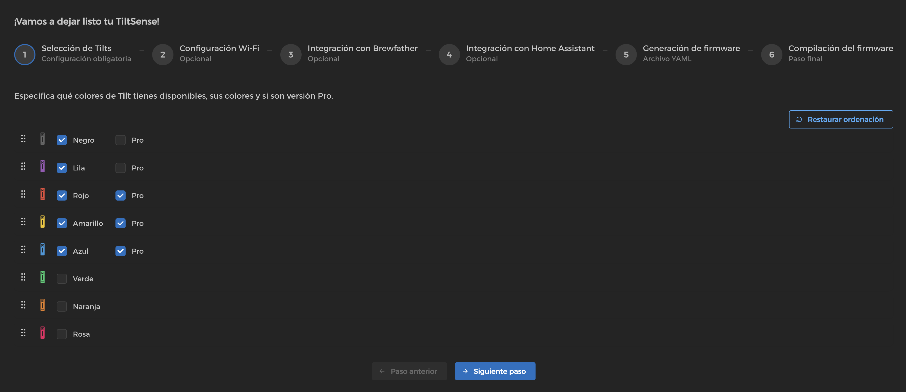
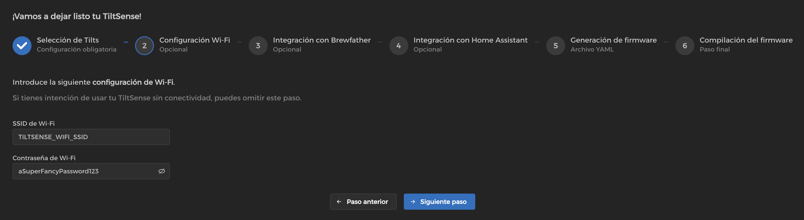
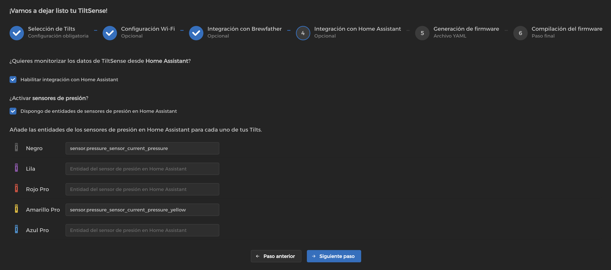
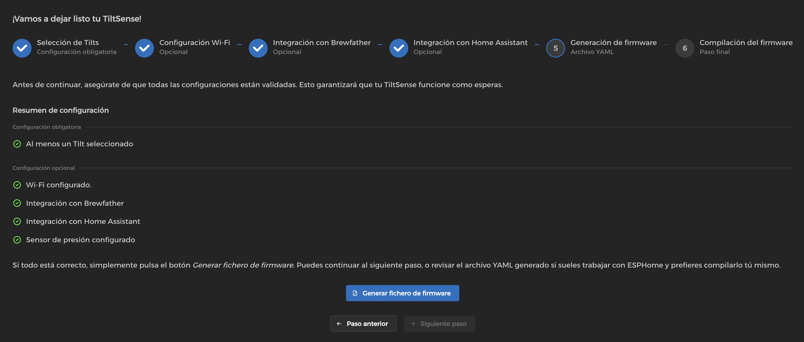
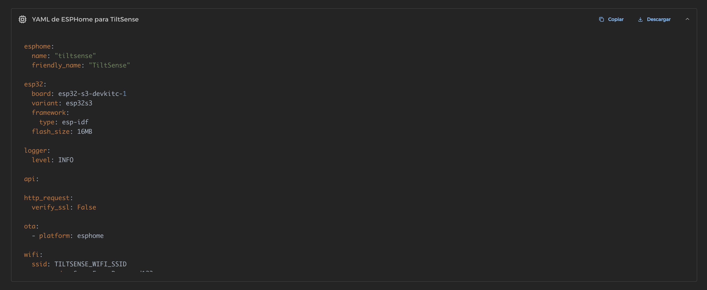
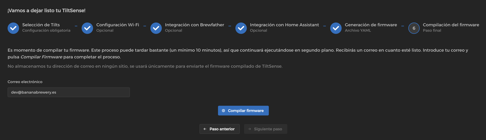
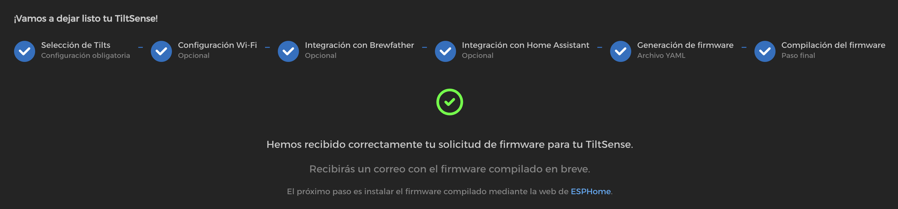

# 🔧 Configuración e Instalación del Firmware

TiltSense proporciona un **Generador de Firmware basado en la web** que te permite crear firmware personalizado para tu
dispositivo de forma sencilla, sin necesidad de escribir ni modificar código.

La aplicación prepara una versión personalizada del firmware según tu parametrización, verifica que todo esté bien
configurado y te entrega un archivo listo para instalar en tu dispositivo TiltSense.

---

## 🌐 ¿Qué es el Generador de Firmware?

Es una herramienta web simple que te permite crear un firmware personalizado para tu dispositivo TiltSense de una manera
guiada por pasos, según tus preferencias y configuración.

Siguiendo los pasos, serás capaz de:

- Seleccionar uno o más Tilt para monitorizar con tu TiltSense.
- Configurar cada Tilt por color e indicar si es un modelo Pro.
- Configurar tu red Wi-Fi para que TiltSense pueda conectarse y enviar datos.
- Activar la integración con Brewfather para registrar en tus fermentaciones.
- Activar la integración con Home Assistant para automatización y monitorización en vivo.
- Añadir soporte para sensores de presión, si está disponible en tu configuración.

Una vez configurado, la herramienta genera un archivo de firmware personalizado que puedes descargar o dejar que el
generador lo compile por ti.

Puedes acceder al generador aquí:  
👉 **[Firmware Builder](https://bananabrewery.github.io/TiltSenseFirmwareBuilder)**

[https://bananabrewery.github.io/TiltSenseFirmwareBuilder](https://bananabrewery.github.io/TiltSenseFirmwareBuilder)

---

## 🧩 Configuración Paso a Paso

### Seleccionar Dispositivos Tilt (Obligatorio)

Para usar TiltSense, debes seleccionar **al menos un Tilt**.

Por cada Tilt que habilites:

- Puedes indicar si es un **Tilt Pro** o estándar.
- Si tienes varios Tilts, puedes **ordenarlos** arrastrando y soltando. Este orden define la secuencia en la que
  aparecerán en la pantalla de TiltSense.
- Hay un botón **"Restaurar Ordenación"** para restablecer la ordenación original.

Los Tilts no habilitados no aparecerán en pantalla ni enviarán datos, lo cual mejora el rendimiento y reduce
comunicaciones innecesarias.

---

### Configuración Wi-Fi (Opcional)

Puedes proporcionar tu **SSID y contraseña Wi-Fi** para que TiltSense se conecte a tu red local.

Esto es necesario para:

- Acceder a la **interfaz web** en [`http://tiltsense.local`](http://tiltsense.local)
- Enviar datos a Brewfather o Home Assistant

Si lo omites, TiltSense funcionará en modo sin conexión.

---

### Integración con Brewfather (Opcional)

Activa esta opción si deseas que TiltSense envíe los datos a tu **cuenta de Brewfather**.

Para configurarlo, necesitas proporcionar:

- Tu **Custom Stream ID** — clave API usada para enviar datos a Brewfather (ej. `a1b2C3d4E5f6G7`).

TiltSense enviará:

- **Densidad**
- **Temperatura**
- **Presión** (si hay un sensor configurado y habilitado)

Los datos se envían cada **15 minutos**, siguiendo las especificaciones oficiales de Brewfather.

> 🔗 Puedes encontrar tu Custom Stream ID y aprender cómo utilizarla en la documentación
> oficial: [docs.brewfather.app/integrations/custom-stream](https://docs.brewfather.app/integrations/custom-stream)

---

### Integración con Home Assistant (Opcional)

Si se activa, TiltSense se conecta a la red local e **integra con Home Assistant** como un nodo nativo de ESPHome.

TiltSense expone las siguientes entidades a Home Assistant:

- Lecturas de **densidad** y **temperatura** para cada Tilt habilitado.
- **Interruptores** para activar o desactivar Tilts remotamente — Del mismo modo que si lo haces mediante la pantalla
  táctil.
- **Tensión de la batería** y estimación del **porcentaje de carga**.

Esto permite la monitorización y control total de tu proceso de fermentación directamente desde Home Assistant.

> 🧠 No se requiere ninguna configuración avanzada — solo añade TiltSense a través de la integración ESPHome en Home
> Assistant.

---

### Sensor de Presión - Home Assistant (Opcional)

Si activas la integración con Home Assistant, puedes vincular **sensores de presión externos** en TiltSense.

Al activar esta opción:

- Aparecerá una sección nueva con los Tilt habilitados previamente.
- Para cada uno de ellos, puedes introducir el **ID de la entidad** del sensor de presión (ej.
  `sensor.pressure_sensor_current_pressure`).
- Estas entidades deben existir y estar disponibles previamente en Home Assistant.

Asignando un sensor de presióna un Tilt permite:

- Mostrar la **presión en vivo** junto con la temperatura y la densidad en la pantalla.
- El valor de la presión se enviará a Brewfather cada 15 minutos (si está habilitada esa integración).

> 🧠 Esta configuración permite monitorizar de manera avanzada el proceso de fermentación bajo presión, combinando la
> densidad, temperatura y presión en un mismo origen de datos.

---

## ✅ Validación de la Configuración

Antes de generar el firmware, la aplicación muestra un **Resumen de configuración** con todas las opciones
seleccionadas.

Este resumen sirve como validación final para asegurar la consistencia del setup. Por ejemplo:

- Que los campos requeridos estén rellenados.
- Que Wi-Fi esté configurado correctamente si usas las integraciones de Brewfather o Home Assistant.
- Que no haya conflictos o campos incompletos en la configuración.

Una vez el proceso queda validado:

- Se activará el botón **"Generar fichero de firmware"**.
- Se crea un archivo YAML de ESPHome completo y adaptado a tu configuración.

El fichero YAML se puede visualizar en un visor de código integrado que permite:

- **Previsualizar** la configuración completa.
- **Copiar** el YAML por si quieres compilar e instalar el firmware mediante ESPHome por tu cuenta.
- **Descargar** el archivo para instalarlo manualmente o echar un vistazo en offline.

> 🛠️ Los usuarios avanzados pueden usar su instancia de ESPHome directamente. Para el resto, continua al próximo paso y
> deja que la aplicación **compile el firmwpare por ti automáticamente**.

---

## 🛠️ Compilar y Descargar el Firmware

Una vez tu configuración ha sido validada, puedes proceder con la compilación de tu firmware.

### Cómo Funciona

- La app te guiará a la sección de **Compilación del firmware**.
- La compilación del firmware requiere de grandes recursos para procesar y puede tardar varios minutos (hasta **10
  minutos**).
- Para asegurar la operativa, la compilación se realizará **en segundo plano**.
- Una vez esté todo listo, recibirás el archivo de firmware compilado (`firmware.factory.bin`) mediante un **correo
  electrónico** directo en tu buzón.

### Por Qué se Solicita tu Email

- Tu dirección de correo electrónico es requerido para hacerte llegar el firmware compilado.
- Tu email **no se guarda ni se almacena** — se usa únicamente una vez para entregar tu firmware personalizado.
- Sin introducir un email válido, el proceso de compilación no se puede completar.

### Política de Compilación

Para asegurar un uso adecuado y óptimo de los recursos:

- Cada usuario puede compilar **una firmware por hora**.
- Si hay múltiples peticiones se compilación se gestionarán mediante una cola por **orden de llegada**.

Recibirás un email con el fichero del firmware compilado adjunto tan pronto como haya terminado el proceso.

> 📩 Revisa tu carpeta de spam si no recibes el correo después de 30 minutos.

El paso final es **instalar el firmware** en tu dispositivo TiltSense. Sigue a la próxima sección para más información.

---

## ⚡ Cómo Flashear el Firmware

Para instalar el firmware:

1. Conecta el dispositivo TiltSense por **USB-C** a tu ordenador.
2. Abre [ESPHome Web Flasher](https://esphome.github.io/esphome-web/).
3. Haz clic en **"Connect"** y selecciona el dispositivo ESP32-S3.
4. Carga el archivo `.bin` descargado en el anterior paso.

> 💡 Si el proceso de instalación falla, puede que debas **mantener pulsado el botón de BOOT** de tu placa ESP32-S3
> mientras lo conectas al ordenador.

---

## 🧯 Solución de Problemas

### "Timed out waiting for packet header"

- Asegúrate de que el cable USB-C **sirve para datos** y no se trata de un cable únicamente para carga.
- Mantén pulsado **BOOT** mientras haces clic en "Connect".

### No hay conexión Wi-Fi tras flashear

- Recompila el firmware asegurando que Wi-Fi está bien escrito.
- Verifica que tu red sea de **2.4GHz** (ESP32-S3 no soporta redes 5GHz).

### No aparecen los datos del Tilt

- Asegúrate de que el Tilt está activo y transmitiendo.
- Verifica que el color del dispositivo físico coincida con el configurado en el firmware.
- Comprueba que el Tilt esté habilitado en la pantalla (no se muestra en color gris).

---
Para cualquier soporte adicional, visita las [Discusiones en GitHub](https://github.com/bananabrewery/TiltSense/discussions) o
abre un [Issue](https://github.com/bananabrewery/TiltSense/issues).
