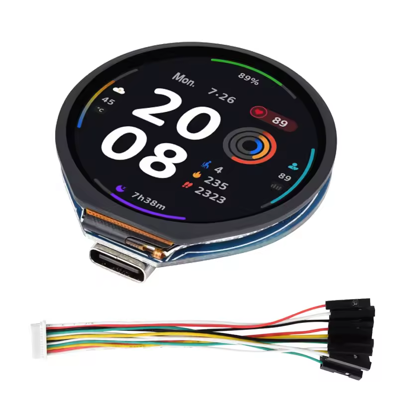
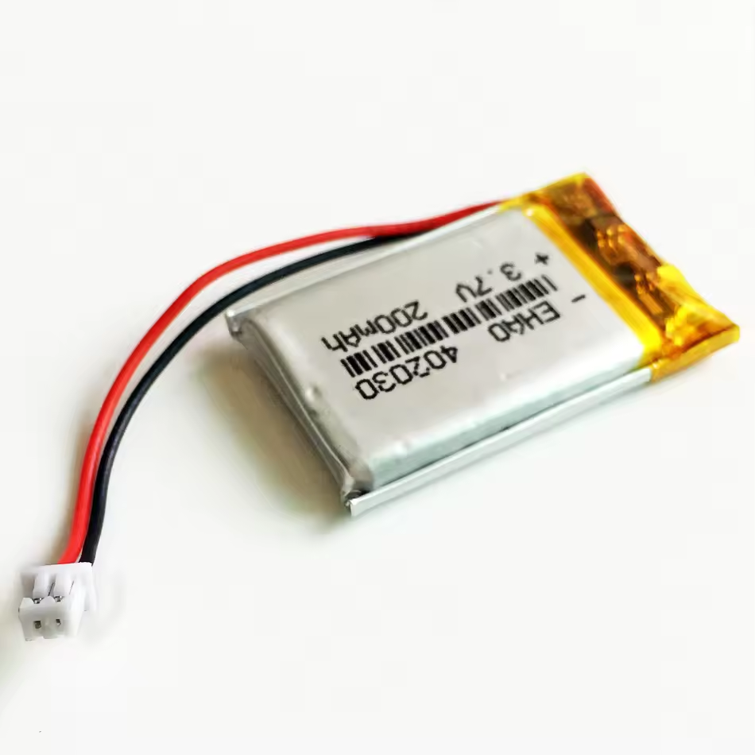
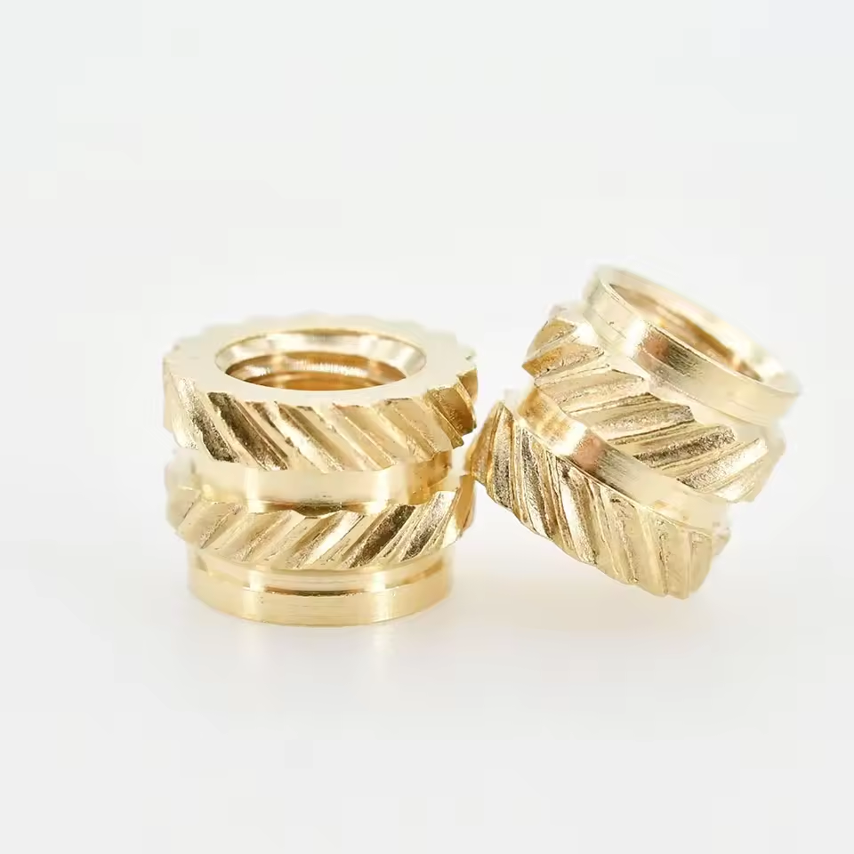
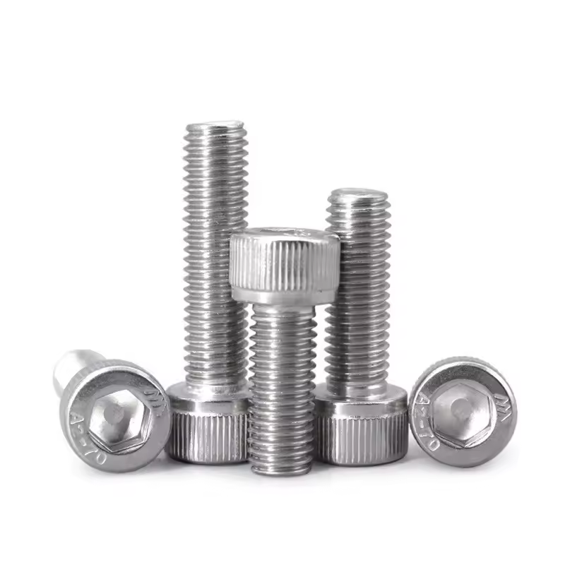
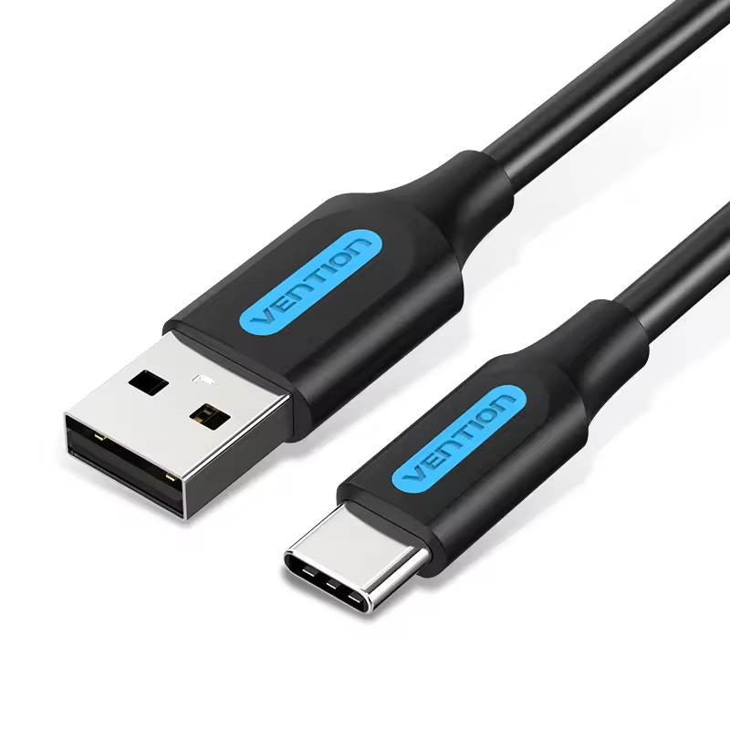

# Requisitos de Hardware

Esta sección describe la lista completa de componentes necesarios para ensamblar un dispositivo **TiltSense**
funcional.  
Los componentes seleccionados están optimizados para ser compactos, fiables y fáciles de montar, utilizando piezas
asequibles y ampliamente disponibles.

## Componentes Requeridos

### 🔹 ESP32-S3 con pantalla táctil redonda de 1.28"

[Comprar en AliExpress](https://s.click.aliexpress.com/e/_oBHq2mi)

  

Una placa de desarrollo ESP32-S3 todo en uno que incluye:

- Pantalla TFT LCD redonda de **1.28"** con chip **GC9A01A**
- Pantalla táctil capacitiva con controlador **CST816S**
- USB-C integrado, circuito de carga y acceso a pines GPIO

> 📌 Este es el núcleo del sistema TiltSense. Asegúrate de que tu versión incluya tanto la pantalla GC9A01A como el
> controlador táctil CST816S.

Para más detalles técnicos, esquemas de pines y especificaciones, consulta la documentación oficial de Waveshare:  
🔗 [ESP32-S3-Touch-LCD-1.28 — Waveshare Wiki](https://www.waveshare.com/wiki/ESP32-S3-Touch-LCD-1.28)

---

### 🔋 Batería LiPo – 3.7V (1S) 200 mAh con conector JST 1.25 mm

[Comprar en AliExpress](https://s.click.aliexpress.com/e/_op2Asqw)

  

Pequeña batería de litio recargable que alimenta el dispositivo cuando no está conectado por USB.

- Opcional pero soportada
- Proporciona aprox. 45 minutos de autonomía
- Útil para mover el dispositivo o en caso de cortes de energía temporales

> ⚠️ **Importante**: Verifica siempre la **polaridad** antes de conectar la batería. Algunos proveedores utilizan
> conectores invertidos que podrían dañar la placa.

---

### 🔩 Inserciones roscadas M2 de latón (Heat-Set)

[Comprar en AliExpress](https://s.click.aliexpress.com/e/_okAnuHg)

  

Inserciones roscadas para reforzar los puntos de anclaje de la carcasa impresa en 3D:

- Dimensiones: **M2 × L2 mm × OD3.2 mm**
- Se instalan con soldador o herramienta de inserción térmica

---

### 🔧 Tornillos M2x5 mm

[Comprar en AliExpress](https://s.click.aliexpress.com/e/_omZDYlo)

  

Tornillos métricos pequeños para fijar la placa ESP32 a la carcasa y unir las partes del dispositivo.

---

### 🧲 Imán de Neodimio – 20×3 mm

[Comprar en AliExpress](https://s.click.aliexpress.com/e/_okD0ylg)

  

Imán circular insertado en la parte trasera de la carcasa, que permite fijar el dispositivo firmemente sobre superficies
metálicas como fermentadores o neveras.

---

### 🖨️ Carcasa impresa en 3D

[Descargar desde MakerWorld](https://makerworld.com/en/models/1509302-tiltsense#profileId-1580036)  
Carcasa personalizada diseñada para:

- Inserción sencilla de la placa ESP32
- Compartimento para batería
- Soporte para montaje magnético

> Las instrucciones de impresión y los archivos STL están disponibles en MakerWorld. Diseñada para impresoras FDM
> estándar.

---

### 🔌 Cable USB-A a USB-C

[Comprar en AliExpress](https://s.click.aliexpress.com/e/_oCeMiAi)

  

Usado para:

- Flashear el firmware usando TiltSense Web Builder
- Cargar la batería interna
- Mantener TiltSense alimentado durante todo el proceso de fermentación

---

## Componentes Opcionales

### 📈 Sensor de Presión *(Opcional — documentación completa próximamente)*

TiltSense ya soporta monitorización de presión a través de **sensores externos integrados mediante Home Assistant**.
Esto permite un perfilado avanzado de la fermentación combinando lecturas de densidad y presión en tiempo real.

Un módulo de sensor de presión — diseñado y probado por **Banana Brewery** — ya está desarrollado y completamente
funcional. Se publicará próximamente la documentación detallada sobre su **montaje, cableado y configuración** como
expansión oficial del ecosistema TiltSense.

---

## Herramientas Adicionales

Para ensamblar TiltSense, también puedes necesitar:

- Un **soldador** (para insertar los heat-sets o hacer modificaciones)
- **Destornillador o punta hexagonal M2**
- **Cinta de doble cara**, silicona caliente o un trozo pequeño de espuma blanda *(opcional, para sujetar la batería)*  
  Para evitar que la batería se desplace dentro de la carcasa, puedes usar adhesivo o insertar un trozo de espuma blanda
  y ligera para mantenerla en su sitio sin ejercer presión sobre el cableado.

---

## Notas

- Los componentes aquí listados están basados en montajes ya probados y verificados.
- La disponibilidad puede variar según la región; se pueden usar piezas equivalentes si coinciden en especificaciones.
- Verifica siempre el voltaje y la polaridad antes de conectar componentes, especialmente baterías y sensores externos.

